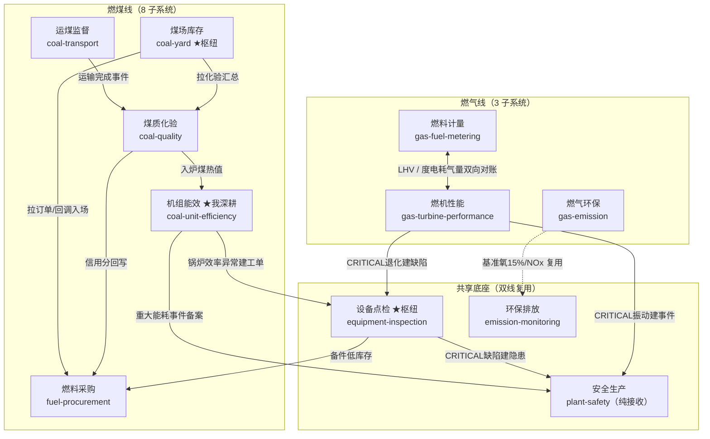
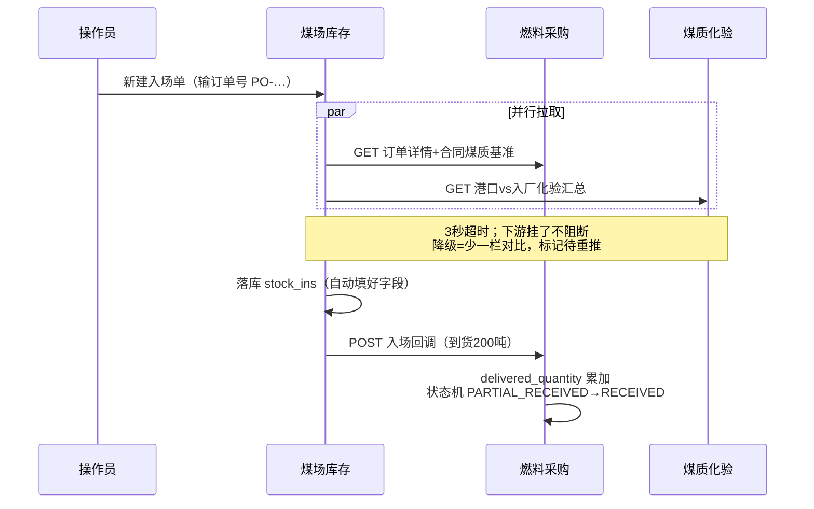
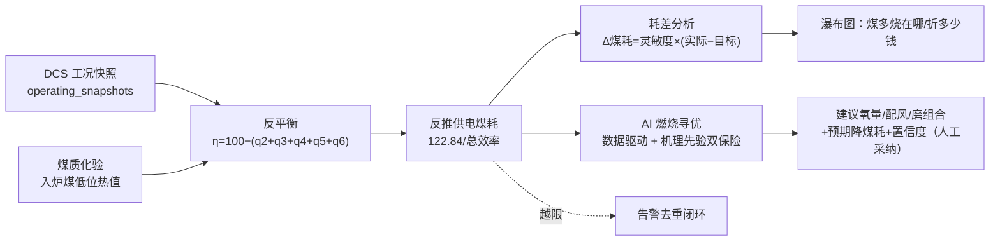

# 面试白板架构图

> 用法：面试官让你画架构时用。**先画整体（图 1），被追问联动时画图 2，被追问算法时画图 3。**
> 下面是 mermaid（GitHub 可直接渲染）；白板上画简化版即可，记住"谁是枢纽、箭头朝哪"。

---

## 图 1：平台总览（双线 + 共享底座）

白板要点：**左边燃煤线、右边燃气线、中间四个共享底座**。强调"独立库、HTTP 联动、失败降级"。

口述一句：「**煤场库存**和**设备点检**是两个枢纽（一个同时拉两边、一个同时推两边），**安全生产**是最纯粹的接收方。」

---

## 图 2：一次"入场登记"的跨系统联动（讲最终一致/降级时画）

白板要点：**操作员只点一下保存，系统层完成三方数据流转 + 一次状态机推进**。

口述要点：① 两路拉取**并行**；② 任一路失败**降级不报错**；③ 回调推进**状态机**；④ 幂等键保证回调重试不会重复累加。

---

## 图 3：机组能效计算链路（讲算法深度时画）

白板要点：**DCS 工况 → 反平衡算损失 → 反推煤耗 → 耗差折算成钱 → AI 寻优给动作**。

口述钩子：「**反平衡比正平衡靠谱**，因为它不依赖精测入炉煤量；**AI 寻优加了机理先验兜底**，样本不足时不盲信模型——这是工业场景'模型不可信时怎么降级'的处理。」

---

## 白板速记（不看图也能画）
- 总览：左煤右气中间共享；**煤场、点检两枢纽，安全是接收方**。
- 联动：**并行拉取 → 降级不阻断 → 回调推状态机 → 幂等防重**。
- 能效：**工况+热值 → 反平衡 → 反推煤耗 → 耗差折钱 → AI 寻优**。
